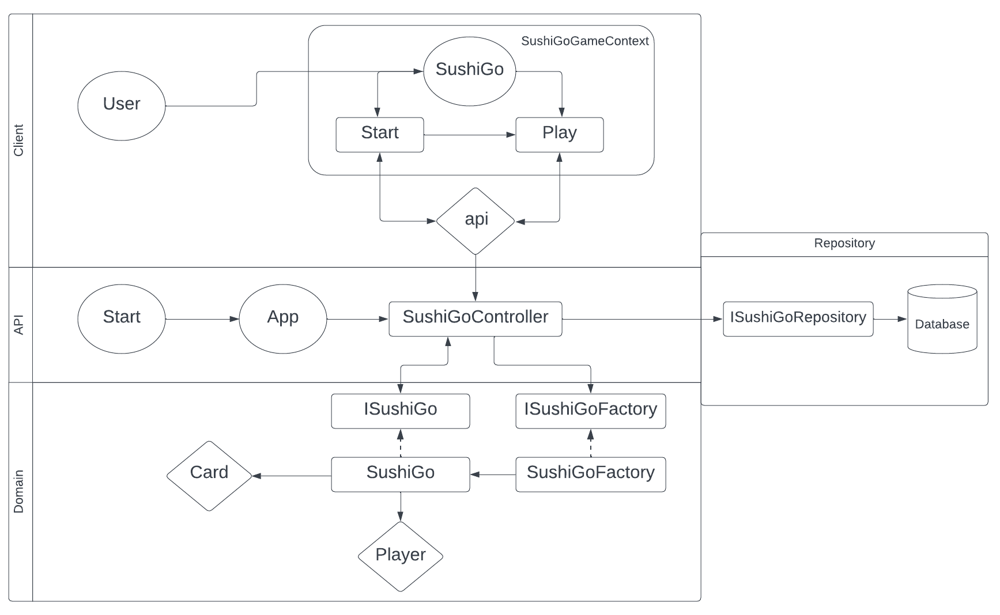

# Architecture
This projest consists of four different layers. Three of those layers are back-end layers: The domain, api and repository layer. The fourth layer is a front-end layer: The client layer. In the diagram below is a schematic overview of the four layers and how the interact. At the moment there is no database added yet, but this might be added in the future.



# Software Stack

Below you can find the software stack that is used for each layer of this project.

### Client
- Typescript
- React.js
- Vite

### Domain/Api
- Java
- Jetty server

### Repository
- MySQl

# External dependencies

The external dependencies can be found in the following files:
- pom.xml
- package.json


# Map en bestand structuur

```bash

+---api
▒   +---src
▒       +---main
▒       ▒   +---java
▒       ▒       +---sushigo
▒       ▒           +---api
▒       ▒               +---controllers
▒       ▒               +---models
▒       +---test
▒           +---java
▒               +---sushigo
▒                   +---api
+---client
▒   +---contexts
▒   +---src
▒       +---components
▒       +---layouts
▒       +---pages
▒       +---services
+---domain
▒   +---src
▒       +---main
▒       ▒   +---java
▒       ▒      +---sushigo
▒       ▒          +---domain
▒       +---test
▒           +---java
▒               +---sushigo
▒                   +---domain
+---persistence
    +---src
        +---main
            +---java
              +---sushigo
                   +---persistence

```


